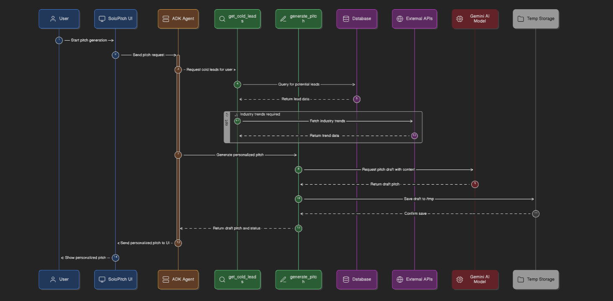

# SoloPitch — AI-powered CRM & Outreach Engine

A multi-agent AI system built with Google ADK that helps solopreneurs
identify cold leads, research their industries, draft personalized pitches,
and schedule follow-up calls — all from a single API call.

## Overview

Solopreneurs and freelancers lose deals not because their offer is weak, but
because outreach doesn't scale — researching each lead's industry, writing a
genuinely personalized pitch, and coordinating a call all take time most
solo operators don't have. SoloPitch solves this with a team of specialized
AI agents that collaborate the way a small sales team would: one researches,
one writes, one schedules, and one reports back on what's working.

Instead of a single chatbot bolted onto a CRM, SoloPitch is built as a true
**multi-agent pipeline** — a root agent orchestrates a sequence of
purpose-built sub-agents, each with its own tools (database access, live web
search, calendar slots, and file-based brand voice templates), so the system
can go from "find cold leads" to a scheduled call with almost no manual
input.

## Tech Stack

- **Agent Framework**: Google Agent Development Kit (ADK) — `SequentialAgent` orchestration
- **LLM**: Gemini (via Vertex AI)
- **Database**: PostgreSQL (`psycopg2`) for lead storage and outreach logging
- **Research**: Tavily Search API for live industry trend data
- **Storage**: Filesystem-based notes for brand voice templates and drafted pitches
- **Deployment**: Docker + Google Cloud Run
- **Package management**: `uv`

## Features

- **Automated Lead Discovery** — queries the CRM database for cold leads that haven't been contacted yet.
- **Live Industry Research** — pulls current trends per lead's industry via Tavily so pitches reference what's actually happening in that space, not generic filler.
- **Personalized Pitch Drafting** — generates pitches in the user's own brand voice (pulled from a saved template) and fills in lead-specific context automatically.
- **Automatic Follow-Up Scheduling** — proposes available call slots and writes them back to the database alongside the draft pitch.
- **Outreach Pattern Analysis** — surfaces trends across all past outreach (industries targeted, volume sent, response/meeting rates) so the user can see what's working.
- **Conversational, Multi-Turn Interface** — the agent asks for missing details (e.g. company name) instead of guessing, and can chain multiple tool calls to fully resolve a single request like *"Find cold leads and run outreach."*

## Technical Workflow

A single user request flows through the full agent pipeline before a
response is returned:

1. **User → SoloPitch UI**: the user sends a request (e.g. *"Draft a pitch
   for Divya at GreenMatter and schedule a call"*).
2. **UI → ADK Agent (root)**: the request is forwarded to the root agent,
   which owns the session and decides which sub-agents/tools are needed.
3. **Researcher agent**:
   - Queries the **PostgreSQL** database for the matching lead.
   - Calls the **Tavily Search API** to fetch current industry trends for
     that lead's sector, so the pitch references real, timely context.
4. **Drafter agent**:
   - Pulls the user's saved **brand voice template** from filesystem notes.
   - Sends the lead data + trend research to the **Gemini** model to
     generate a personalized draft pitch.
   - Saves the draft to temporary storage and confirms the save.
5. **Scheduler agent**:
   - Retrieves available call slots.
   - Writes the draft pitch and slot options back to the database, updating
     the lead's outreach status.
6. **Analyst agent** *(on request)*:
   - Aggregates outreach history from the database — industries contacted,
     volume per industry, and response/meeting rates — into a plain-language
     summary.
7. **ADK Agent → UI → User**: the final, synthesized response (draft pitch +
   proposed slots, or the outreach analysis) is streamed back to the user.

This full sequence — including the tool calls and data passed between each
stage — is illustrated below:



## Demo

The agent successfully runs multi-step, tool-chained requests end-to-end.
A few examples from live sessions:

- **Full outreach run**: given *"Find cold leads and run outreach,"* the
  agent found 2 cold leads in cleantech, researched current SaaS/cleantech
  trends, drafted and saved personalized pitches for both leads, identified
  open call slots, and summarized the whole run in one response.
- **Targeted pitch + scheduling**: asked to *"Draft a pitch for Divya at
  GreenMatter and schedule a call,"* the agent chained
  `get_brand_voice_template` → `get_available_slots` →
  `analyze_outreach_patterns` and returned a complete pitch plus three
  proposed call times.
- **Outreach analytics**: on request, the analyst agent broke down outreach
  volume by industry (logistics, edtech, cleantech, healthtech, fintech) and
  flagged that no responses or meetings had been recorded yet — giving the
  user a clear signal on where to adjust strategy.
- **Graceful clarification**: when asked to generate an outreach message
  without a company name provided, the agent asked for the missing detail
  instead of fabricating it — then completed the message once given the
  missing field.

*(See `docs/sequence-diagram.png/` for full session transcripts.)*

## Agent Architecture

```
Business Manager (root_agent)
└── outreach_workflow (SequentialAgent)
    ├── researcher   → finds cold leads + industry trends
    ├── drafter      → writes personalized pitches
    ├── scheduler    → appends meeting slots + updates DB
    └── analyst      → surfaces outreach patterns
```

## Setup

### 1. Clone and install

```bash
git clone <your-repo>
cd solopitch

uv venv --python 3.12
source .venv/bin/activate
uv pip install -r requirements.txt
```

### 2. Configure environment

```bash
cp .env.example .env
# Edit .env with your values
```

### 3. Set up PostgreSQL

```bash
psql -U your_user -d your_db -f schema.sql
```

### 4. Get a Tavily API key (free)

Sign up at https://tavily.com and paste the key into `.env`.

### 5. Run locally

```bash
adk web solopitch
# Opens at http://localhost:8000
```

Try: *"Find cold leads and run outreach"*

## Deploy to Cloud Run

```bash
source .env

# Create service account
gcloud iam service-accounts create solopitch-sa \
  --display-name="SoloPitch Service Account"

# Grant Vertex AI access
gcloud projects add-iam-policy-binding $GOOGLE_CLOUD_PROJECT \
  --member="serviceAccount:solopitch-sa@${GOOGLE_CLOUD_PROJECT}.iam.gserviceaccount.com" \
  --role="roles/aiplatform.user"

# Deploy
uvx --from google-adk==1.14.0 \
  adk deploy cloud_run \
  --project=$GOOGLE_CLOUD_PROJECT \
  --region=us-central1 \
  --service_name=solopitch \
  --with_ui \
  . \
  -- \
  --service-account=solopitch-sa@${GOOGLE_CLOUD_PROJECT}.iam.gserviceaccount.com
```

## API Usage

```bash
curl -X POST https://<your-cloud-run-url>/run \
  -H "Content-Type: application/json" \
  -d '{"message": "Find cold leads and run outreach"}'
```

## File Structure

```
solopitch/
├── agent.py          # All agents and tools
├── __init__.py
├── .env.example
├── requirements.txt
├── schema.sql        # PostgreSQL schema + seed data
├── Dockerfile
├── notes/
│   └── follow_up.txt # Brand voice template
└── README.md
```

## MCP Tools Used

| Tool | Purpose | Agent |
|------|---------|-------|
| PostgreSQL (psycopg2) | Lead queries + outreach logging | Researcher, Scheduler |
| Tavily Search API | Industry trend research | Researcher |
| Notes (filesystem) | Brand voice templates + pitch storage | Drafter |
| Calendar (mock → Google Calendar MCP) | Available slot generation | Scheduler |

## Hackathon Track

Submitted under **Track 07 — Open Innovation** (Ascendant Agents): a
wildcard track for any AI agent idea outside the listed themes, judged on
originality, feasibility, and real-world impact.
